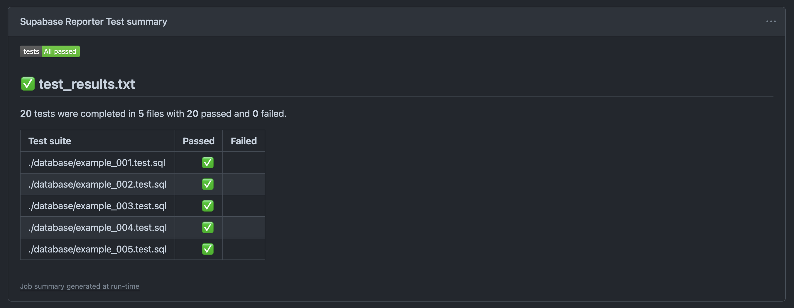
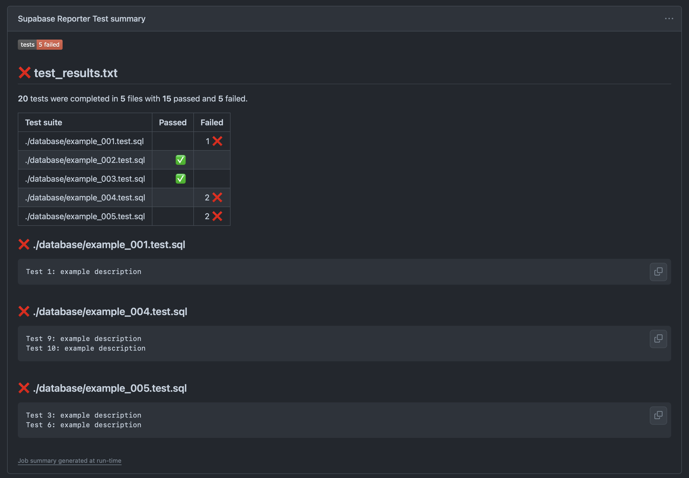

# Supabase Database Reporter

This [Github Action](https://github.com/features/actions) displays the results from Supabase database tests directly in GitHub.

✅ Parses test results from a .txt file and creates beautiful reports as a GitHub job summary.
✅ Provides output parameters such as `conclusion`, `files`, `tests`, `passed` and `failed`.

**How it looks:**
|||
|:--:|:--:|

Do you miss a feature? Please create an [Issue](https://github.com/coderaveHQ/supabase-database-reporter/issues/new) or contribute with a Pull Request.

## Example

Using this action is as simple as:

```yaml
on:
  pull_request:

permissions:
  contents: read
  actions: read
  checks: write

jobs:

  test-supabase-database:

    runs-on: ubuntu-latest

    steps:
      - name: Checkout current repository
        uses: actions/checkout@v4

      - name: Setup Supabase CLI
        uses: supabase/setup-cli@v1
        with:
          version: latest

      - name: Start Supabase database
        run: supabase db start

      - name: Run Supabase database tests
        run: supabase test db > test_results.txt

      - name: Create test report
        uses: coderaveHQ/supabase-database-reporter@v1
        if: always() # Run this step even if previous step failed
        with:
        
          # [required]
          # The name of the file containing the test results
          # At the moment this has to be set to the exact same name as used above
          # in `Run Supabase Database Tests`
          # Also this can only be in TXT format
          file-name: test_results.txt

          # [optional]
          # [default=true]
          # Set this action as failed if test report contain any failed test
          fail-on-error: true

          # [optional]
          # [default=true]
          # Set this action as failed if no test results were found
          fail-on-empty: true
```

## License

The scripts and documentation in this project are released under the
[MIT License](https://github.com/coderaveHQ/supabase-database-reporter/blob/main/LICENSE)
